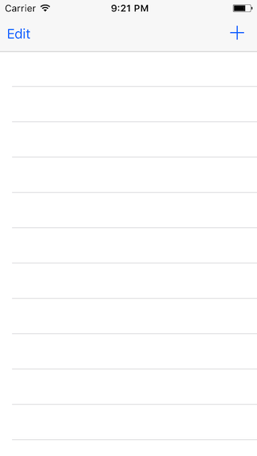
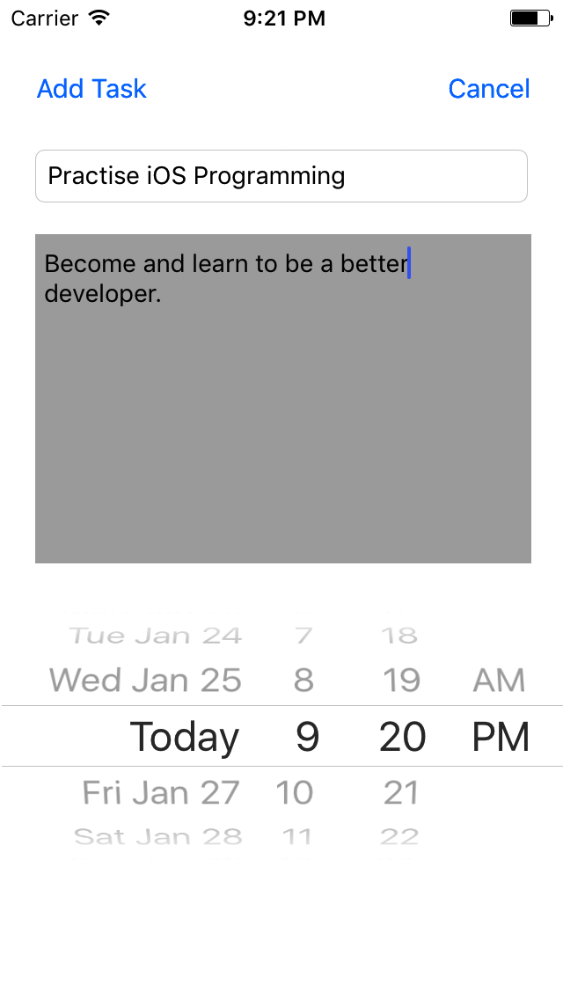

# Overdue-Task-List-Assignment - The Bitfountain iOS 7 Immersive
## iOS 7 Development Course

This project should contain 4 ViewControllers in total. The first ViewController should contain a UITableView to display task objects. The properties of the task model object are title, description, date and completion (YES or NO). In one of the ViewControllers users should be able to add Task objects. These tasks should be displayed on the tableView. The tableView should allow the deletion and reordering of tasks. Users should be able to alter the completion of a task from YES to NO by tapping on the cell. The UITableViewCell should change color depending on its’ status completion and/or whether the task is overdue. The tableView should also have an accessory button to transition to a ViewController which should display detailed information about the task. From the detailed information ViewController users should be able to transition to a new ViewController which allows editing of the task. If the user edits a task this information should be persisted to NSUserDefaults.

